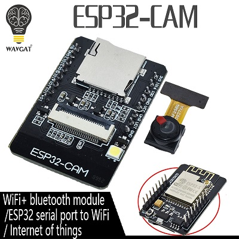

# my esphome configs

## Overview

The configurations are modular. Each device will have a single yaml file, this file will use a device specific file from the templatefiles directory.

The device specific file will then import the common settings from either

- [common.yaml](templatefiles/common.yaml) (THIS USES DHCP)
- [common_static.yaml](templatefiles/common_static.yaml) (THIS USES STATIC IP)

The common files will pull the secrets from templatefiles/secrets.yaml

## Common features

Each Device has the following standard sensors:

- MAC address
- Uptime
- Version
- Wifi Signal (in dB)
- Wifi Strength (in english)

Each Device also has the following switch:

- Restart

## Devices

- Room Sensor
  
  This is a NodeMcu with a DHT11 connected to Pin D2.
  The temperature and humidity values are averaged to reduce erroreous spikes in values.

  [Configuration file: templatefiles\roomsensor.yaml](templatefiles/roomsensor.yaml)

- Room Sensor (esp32)
  
  This is a Nodemcu-esp32 with a DHT11 connected to GPIO15.
  The temperature and humidity values are averaged to reduce erroreous spikes in values.
  
  [Configuration file: templatefiles\roomsensor_esp32.yaml](templatefiles/roomsensor_esp32.yaml)

- espcam32
  
  

  This is an AIThinker esp32cam board available from [AliExpress](http://s.click.aliexpress.com/e/bdKN2vBK) I have installed heatsinks on the esp32 chip, as I found that the camera would stop working after a few minutes/hours.

  The Flash is presented as a switch.

  [Configuration file: templatefiles\aithinker_esp32cam.yaml](templatefiles/aithinker_esp32cam.yaml)

- SonOff POW R1
  
  This is a SonOff POW R1

  [Configuration file: templatefiles\sonoffpowr1.yaml](templatefiles/sonoffpowr1.yaml)

- SonOff POW R2
  
  This is a SonOff POW R2
  
  [Configuration file: templatefiles\sonoffpowr2.yaml](templatefiles/sonoffpowr2.yaml)

- Blackboard-T5

  [Configuration file: templatefiles\blackboardt5.yaml](templatefiles/blackboardt5.yaml)

